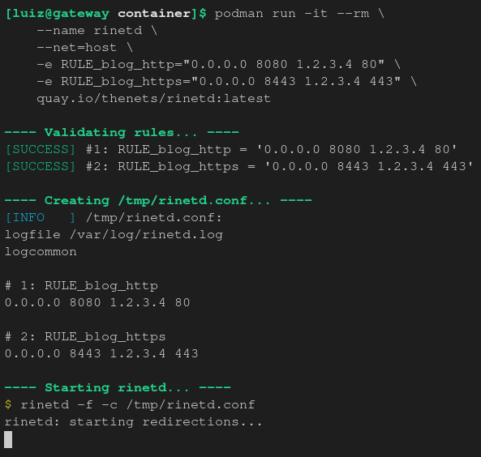

[](https://github.com/thenets/rinted-container/actions/workflows/container-release-auto-patch.yml)

# rinetd: Containerized

A user-mode TCP port redirection server. Made by Thomas Boutell and Sam Hocevar.

---

Container images:
- [Quay.io](https://quay.io/repository/thenets/rinetd)
  - `quay.io/thenets/rinetd:latest`

## How to use

You must have Podman or Docker installed in your system. I recommend Podman for security reasons, learn more:
- My blog post: [How to securely share secrets with podman containers](https://blog.thenets.org/how-to-securely-share-secrets-with-podman-containers/)
- Red Hat's docs: [What is Podman? Podman vs. Docker](https://www.redhat.com/en/topics/containers/what-is-podman#podman-vs-docker)

You can or expose the ports to the host or use the `--net=host` option to use the host network stack.



```bash
# Rule format:
#   <from_ip> <from_port> <to_ip_or_domain> <to_port>

# Example:
#   host 8080 -> container 80
#   host 8443 -> container 443

# Method 1: Using the port redirect
podman run -it --rm \
    --name rinetd \
    -p 8080:80 \
    -p 8443:443 \
    -e RULE_blog_http="0.0.0.0 80 1.2.3.4 80" \
    -e RULE_blog_https="0.0.0.0 443 1.2.3.4 443" \
    quay.io/thenets/rinetd:latest

# Method 2: Using the host network stack
podman run -it --rm \
    --name rinetd \
    --net=host \
    -e RULE_blog_http="0.0.0.0 8080 1.2.3.4 80" \
    -e RULE_blog_https="0.0.0.0 8443 1.2.3.4 443" \
    quay.io/thenets/rinetd:latest
```

## Why this project exists?

The rinetd project is my prefered way to redirect TCP ports. It is simple, easy to use and it is reliable. However, recent Linux distributions have removed the package from their repositories and it behaves as an old project, requiring dymamic libraries and a single configuration file.

This repository contains a different approach, putting the rinetd inside Linux containers, with periodic builds for security patches, and a simple way to configure the rules using environment variables.

## Credits

rinetd, by Thomas Boutell and Sam Hocevar. Released under the terms
of the GNU General Public License, version 2 or later.

This program is used to efficiently redirect connections from one IP
address/port combination to another. It is useful when operating virtual
servers, firewalls and the like.

To build under Unix, run `./bootstrap` to create the configuration
files, then `./configure` to create the build files, and then type
`make` to build rinetd. To install, type `make install` as root.

For documentation run `make install`, then type `man rinetd` for
details. Or, read `index.html` in your browser.

